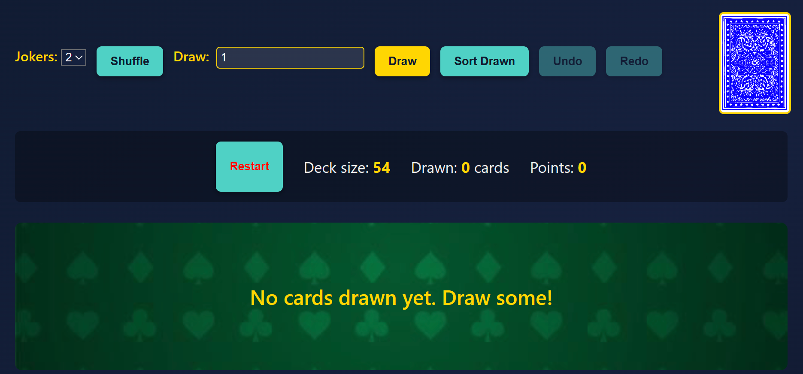

# Deck of Cards


[](https://github.com/claudiussx/deck-of-cards/actions/workflows/ci.yml)

A simple Angular application (TypeScript, HTML, CSS) that lets you shuffle a standard 52‑card deck (with optional jokers), draw cards, track drawn cards and their point total, and undo/redo actions.

---

## 🔧 Getting Started

1. Clone the repository:
   ```bash
   git clone https://github.com/claudiussx/deck-of-cards
   ```
2. Install prerequisites:
   - Node.js & npm (v14+)
   - Angular CLI (`npm install -g @angular/cli`)
3. Start the app:
   ```bash
   cd deck-of-cards/angular-app
   ng serve
   ```
4. Open your browser to `http://localhost:4200/`.

---

## 📖 User Manual

All controls are clearly labeled (see screenshot above):

- **Joker dropdown**: Lets you choose between 0, 1 and 2 jokers to add in your deck instance.
- **Shuffle**: Randomizes the remaining deck (click the button or the deck image).
- **Draw [n]**: Enter a number and click **Draw** to remove that many cards from the deck.
- **Sort Drawn**: Reorders drawn cards by suit (Clubs, Spades, Hearts, Diamonds) then rank, placing jokers last.
- **Undo / Redo**: Step backward or forward through your shuffle/draw/sort history.
- **Out of Cards**: When the deck is empty, you’ll see an **OUT OF CARDS** placeholder.
- **Restart**: Lets you **hard** reset the deck and all history of changes for a fresh start (CANNOT BE UNDONE).

---

## 📁 Project Structure

```
/ (repo root)
├─ .gitignore
├─ .gitattributes
├─ README.md
└─ angular-app/     ← Angular project folder
   ├─ src/
   │  ├─ index.html     ← App entry point
   │  ├─ main.ts        ← Bootstraps AppModule
   │  ├─ styles.css     ← Global styles & CSS variables
   │  └─ app/
   │     ├─ core/
   │     │  ├─ commands/      ← Command pattern for undo/redo
   │     │  ├─ models/        ← `Card`, `Suit`, `Rank` definitions
   │     │  └─ services/
   │     │     └─ deck.service.*  ← Main deck logic & state
   │     ├─ features/
   │     │  └─ deck-view/
   │     │     └─ deck-view.component.*
   │     ├─ app.component.*
   │     └─ app.module.ts
   └─ angular.json
```

---

## 🛠 Main Function Documentation

### DeckService (src/app/core/services/deck.service.ts)

- **resetDeck(jokersCount: number = 0)**

  - Clears history, rebuilds a shuffled 52‑card deck plus jokersCount jokers, and empties the drawn pile.

- **shuffle()**

  - Uses a SnapshotCommand to apply a Fisher‑Yates shuffle to the deck, supporting undo/redo.

- **draw(count: number)**

  - Removes up to `count` cards from the top of the deck into the drawn pile via SnapshotCommand.

- **sortDrawn()**

  - Sorts drawn cards by suit (Clubs → Diamonds) then by value, placing jokers at the end, with undo/redo support.

- **undo() / redo()**

  - Rolls the deck and drawn pile state backward or forward using the command history.

- **get drawnPoints(): number**

  - Returns the sum of `value` for all standard cards in the drawn pile (jokers contribute 0).

### DeckRepository (src/app/core/services/deck.repository.ts)

Handles loading/saving deck state (e.g. to localStorage) so your draws persist across page reloads.

### Command Pattern (src/app/core/commands)

- **SnapshotCommand**: Captures the deck+drawn arrays before and after an action. Used by shuffle, draw, and sort for undo/redo.

---

### DeckViewComponent (src/app/features/deck-view/deck-view\.component.ts)

- **ngOnInit()**

  - Subscribes to `deck$` and `drawn$` observables to keep local `deck`, `drawn`, and `points` properties in sync.

- **ngOnDestroy()**

  - Unsubscribes from all subscriptions to prevent memory leaks.

- **onReset(jokers: number)**

  - Delegates to `DeckService.resetDeck(jokers)` to rebuild the deck with a specified number of jokers.

- **onShuffle()**

  - Sets the `isShuffling` flag to `true`, calls `DeckService.shuffle()`, and clears the flag after 500 ms to trigger the shuffle animation.

- **onDraw(count: number)**

  - Records the deck-back element’s position, calls `DeckService.draw(count)`, then:
    1. Forces change detection.
    2. Animates newly drawn cards from the deck position to their grid slots.
    3. Applies a special `.joker-effect` animation if a joker is drawn.

- **onSort()**

  - Calls `DeckService.sortDrawn()` to reorder drawn cards.

- **onUndo() / onRedo()**

  - Invokes `DeckService.undo()` / `DeckService.redo()` for history navigation.

- **get canDraw(): boolean**

  - Returns `true` when there are cards left in the deck (enables the Draw button).

- **get canUndo() / canRedo()**

  - Reflects whether undo/redo commands are available, controlling button disabled states.

- **trackByCard(\_idx: number, card: Card): string**

  - Provides a unique key for each card (`suit-rank` or `joker-id`) to optimize Angular rendering.

- **getCardImage(card: Card): string**

  - Computes the correct image path (`assets/cards/...`) based on card type, suit, and rank.

- **getCardLabel(card: Card): string**

  - Returns a human-readable label (e.g. "Queen of Hearts" or "Joker #1").

---

## 🕒 Development Time Breakdown

**Total Development Time**: \~20 hours

- **Writing functions & backbone**: 6.5 hours
- **Testing**: 3 hours
- **Debugging**: 4 hours
- **UI overhaul**: 5 hours
- **Documentation**: 1.5 hours

Below is an approximate record of the time spent on each phase of the project:

- **Initial planning, research, technologies, setup**: 2–3 hours
- **Initial model and services**: 2 hours 30 minutes
- **Tests for DeckService (including debugging)**: 1 hour 30 minutes
- **Refactor to good practices (repository, factory, command pattern)**: 1 hour 30 minutes
- **DeckViewComponent implementation (basic view)**: 1 hour 30 minutes–2 hours
- **DeckViewComponent tests**: 1 hour
- **CI configuration**: up to 1 hour
- **UI overhaul (in multiple parts)**: \~5 hours
- **Overall code testing and debugging**: 3–4 hours
- **Documentation (README and inline comments)**: 1 hour 30 minutes

---

